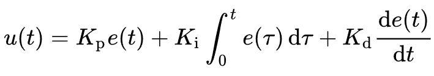

# feedback-and-locking
We will discuss feedback controllers in general, PID loops and how to tune them, analog and digital implementations with software and with physical hardware, locking to a reference - particularly laser locking using high bandwith schemes.

> This is a mini-course for experimental physicists, prepared by Sam Hile around 2023, in the context of the IQT research group at Sussex. It normally involves ~4hrs of interactive lecture/discussion to cover the content. To properly master the ideas, learners should spend probably twice that much time reading further and exploring the topics on their own.

## Contents
1.	Generic process control theory
2.	Human intuition (timescale)
3.	P, I, and D equations
5.	Tuning procedures
6.	Testing/verifying parameter stability and impulse response
7.	Example 1: a course laser wavelength lock
8.	Lock-in detection
9.	PDH error signals
10.	Analog circuitry for near-instant response
11.	Example 2: Toptica FALC
12.	Digital processing and FPGA control
13.	Example 3: Sinara Suservo

## Generic process control theory
We are going to be discussing cloded-loop process control. Aka *FEEDBACK*. There is some system or 'process', we externally control it by first measuring some variable that is a consequence of the process (controller input), deciding how wrong it is with reference to a setpoint, and actuating something to influence the process (controller output). The [Wiki page for PID](https://en.wikipedia.org/wiki/PID_controller) is a nice place to start. (Just read the *Fundamental operation* section fr now, and skim the rest of the page)

## Human intuition (timescale)
Humans are naturally pretty good PID controllers, often without realising it. If you have 3 people and a table/desk, its possible to play a game:

:blue_square: Blue player (setpoint) 🟦 Stand behind the desk, place a blue marker/pen on the desk. Occasionally slide it to the left or to the right to change the setpoint.

:red_square: Red player (process) 🟥 Sit in front of the desk, hold a red marker/pen in front of you on the desk surface. With your other hand, hold a green marker/pen directly above your head. As the green marker (and your arm) is tilted, slide the red marker left/right in response. Try to be consistent, and **do it all with your eyes closed**.

:green_square: Green player (setpoint) 🟩 Stand behind the red player, look at the relative error in the position of their red marker/pen and TILT the green marker/pen to suggest how they should correct for the error. Be genlte and don't break anybody's arm.


## P, I, and D equations
The standard form of the mathematical expressions is something like:


You will also encounter this alternate form at some point in your life:


here the I and D terms are encoded in a way that should hint at the timescales of derivative and integral action. Before getting to carried away, bear in mind that the integral is usually in reality a discrete sum (and typically not with an infinite memory back to t=0), and in reality the derivative is a numerical difference based on the last few samples. The sample period will also renormalise the Ti and Td values.

If you are a mathematician please do delve into derivations of all of the responses, [textbooks on control theory are available](https://doi.org/10.1109/MCS.2007.365006) from all good bookstores.


## Tuning procedures
There are various schemes, including trial-and-error and beer-enabled-tinkering. For a deterministic approach to getting a decent configuration, consider the ZN (Ziegler-Nicholls) method:


You begin by turning all 3 terms to zero and then upping *Kp* to a critical level where obvious ongoing oscillations occur. This is *Ku*, and the period of the oscillations is *Tu*. Now choose either PI or PID mode and set the gains according to the table. If you go for P only mode, you normally find an eternal 'droop' where the value never quite reaches setpoint but is stable. Some (well behaved) systems will react nicely to ZN tuned values, others not so much.

## Testing/verifying parameter stability and impulse response

Once you've read a bit about the concept, dive in and [play with a simulator](https://brightion.github.io/feedback-and-locking/sim). There the blue line represents the setpoint (target value); red "control input" line represents a measurement of the process value; and the green "control output" line shows the actively controlled signal sent out by the controller to try to minimise the error (i.e. overlap red onto blue). I reccommend going through the following steps initially

 * set noise to zero
 * set Ki to zero
 * set Kd to zero
 * set Kp to ~0.5, and wait for things to settle
 * suddenly move the setpoint from positive to negative and back again to observe how fast the system takes to react to an impulse
 * now make small changes to the gains (K values) and repeat the impluse in order to explore...
 * turn the noise back up 

Now, go back to the simulator and explore a little more. You can try the other settings of the process selector. You can attempt to replicate various plots on the wiki page if you feel like it. A perfectly tuned controller will quickly react to a large setpoint change with minimal overshoot and oscillation, and not be overly sensitive to noisy measurement. You can even edit the model script to challenge your friends!

### Example 1: a course laser wavelength lock
[WAnD](https://github.com/OxfordIonTrapGroup/wand) is an (artiq-adjacent) program for scalable laser frequency tuning via one or more [wavelength meters](https://www.highfinesse.com/en/technology/fizeau-principle.html). It, belive it or not, uses a PID loop. Admittedly its only using the P term out-of-the-box. Here is the core logic with the fluff filtered out:

```py
while running:
    # fetch a measurement 
    f_error = await get_freq(laser, offset_mode=True)

    # calculate the voltage change to output
    V_error = f_error * gain

    # fetch the old output and adjust
    v_pzt = await voltage_get()
    v_pzt -= V_error

    # set the new output
    await voltage_set(v_pzt)
```

## Lock-in detection
In some situations, a direct process measurement is impractical or impossible to obtain. This could be where the environment is extremely noisy, or simply where no transducer is capable of digitising the parameter of interest fast enough to be useful. An example of the former is in the implementation of an AM radio. An example of the latter is in locking a narrow linewidth laser source to a reference resonance. See also [Lock-In Amplifier](https://en.wikipedia.org/wiki/Lock-in_amplifier) and [Heterodyne detector](https://en.wikipedia.org/wiki/Homodyne_detection)

#### The radio
If your ye olde radio* just absorbed all the raw EM radiation around 1600kHz, you'd get nothing but garbage. All sorts of stuff is emitting all over the place and to deal with it we designate a particular frequency for each station. You tune to precicely 1611kHz say, using an internal local oscillator in your radio, and correlate whatever chaos the antenna collects with your clean sine wave, and then send the demodulated thing to the speaker. Mathematically its a signal product, hardware-wise its an 'RF mixer', and in the context of our control discussion we could call the arrangement a lock-in amplifier.

*Modern radios have fast microcontrollers and can do it all with digital signal processing, and it tends to work more cleanly - ultimately the strategy is the same.

#### A resonance laser lock
A common trick in atomic physics is to buy a 'cheap' laser that wobbles around a bit in terms of its wavelength, and use some absolute reference like a bunch of Rb atoms that absorb a very specific wavelength. Topica have a [nice little overview](https://www.toptica.com/application-notes/phase-and-frequency-locking-of-diode-lasers/error-signal-generation/general-error-signal-generation-schemes) from which I've borrowed the diagram below. If you intentially wiggle the laser wavelength, you can correlate any wiggle in the transmitted light intensity and decide whether you are on the left or right flank of the resonance. 

As it turns out, mathematically what we want is the derivative of a naturally available signal - something that tells us in which direction to make a correction back to the ideal value (in another way of looking at it, the setpoint is somehow externally defined)

 . . . 


## PDH error signals
The lock-in scheme has a shortcoming - if the resonance is very narrow, it only works when you're very nearly spot-on. Some clever chaps (Pound, Drever & Hall probably) figured out a variant that provides a much bigger capture range, and at the same time tends to have higher bandwidth / faster response time. Win-win!

You can read a [very detailed primer on it](https://doi.org/10.1119/1.1286663) if you like. The very rough summary is that it stretches out the derivative peaks, with a sharp and narrow positive-negative transition at the middle, giving a robust and high quality error signal.


## Analog circuitry for near-instant response
It is possible to do all the maths in the form of analog voltage signals. What you need is a few op-amps, potentiometers, and some RC low-pass and high-pass filter arrangements. Here is a generic schematic:


[More details](https://control.com/textbook/closed-loop-control/analog-electronic-pid-controllers)

### Example 2: Toptica FALC
"The FALC pro is a high-performance controller with unrivalled bandwidth and signal delay. It is the perfect choice for reducing the laser linewidth, e.g. by realizing a PDH lock on a high-finesse cavity in combination with the PDH/DLC pro module. While it is an analog controller and thus reaches extremely low signal delays of typically 10 ns, it features a digital interface, which is responsible for its very convenient usability. It allows remote locking and combining it with the DLC pro lock enables the automatic relock and the click&lock function. It also includes a frequency mixer and thus is the perfect choice to implement an offset phase lock."  --[someone at Toptica](https://www.toptica.com/products/tunable-diode-lasers/laser-locking-electronics/falc-pro)

## Digital processing and FPGA control
For a microcontroller or computer to drive the PID loop, the whole thing must be discretised. Wiki presents a pseudocode implementation of a typical loop like so:
```
previous_error := 0
integral := 0
loop:
   error := setpoint − measured_value
   proportional := error;
   integral := integral + error × dt
   derivative := (error - previous_error) / dt
   output := Kp × proportional + Ki × integral + Kd × derivative
   previous_error := error
   wait(dt)
   goto loop
```
    
### Example 3: Sinara Suservo
The SUServo is a PI feedback controller implemented within the Kasli FPGA, using Urukul and Sampler cards as the output and measurement elements respectively. Its a digital discrete time feedback engine, which can be called an IIR filter (Infinite Impulse Response). Looking at the recurrence relation it is not immediately easy to see how it relates to the pseudocode logic above, and the *Ki* and *Kp* gain parameters which are nevertheless embedded in the *a* and *b* coefficients.


the connection can be seen in the coredevice driver code (I cropped out some confusing edge case handling):


 
# Project
The project is expected to take some tens of hours, so a few days of focussed attention. The objective is to *a)* gain a solid understanding of the broad topic as covered in the lecture-like content above AND *b)* to really become an expert on a narrower element within the realm of feedback/feedforward/locking.

You will write a short report (around four A4 page equivalent) and join in a brief Q&A with other learners on your choice of either:
 * A detailed literature review and analysis based on one of the advanced chapters of Brett Beauregard's '[Improving the Beginner's PID](http://brettbeauregard.com/blog/tag/beginners-pid/)' blog thingy (or an equivalent topic agreed by me)
 * A design and test report on your own implementation of a feedback loop with physical hardware in the lab (or in the home!)

The report should be formatted as markdown and merged into one of the following places within the course repo:
  * [Advanced Topics](advanced.md)
  * [Implementation Examples](implementations.md)

